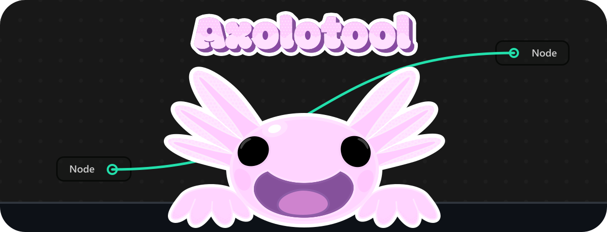
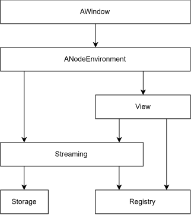

<!-- Banner -->
<p align="center">
  
</p>

<br/>

<!-- Badges -->
<p align="center">
  
  
  
  
  
</p>


## 🚀 Introduction

**Axolotool** is a native (WIP) **Live-App Builder** for real-time desktop applications. 

Instead of compiling and running separate binaries, you build and execute your application live inside Axolotool. 
You can make your own applications using the built-in node editor with standard plugins, or create custom plugins to add new features.

<br/>

> [!TIP]
> 🎬 **Watch the Demo:** [Axolotool v0.1 demo](https://drive.google.com/file/d/1avH0CEg7C-EfxB9lbyyiUPOWbxltmhvb/view?usp=drive_link)

<br/>

<!-- Table of Contents -->
## 📑 Table of Contents

* 🛠️ [Tech Stack](#%EF%B8%8F-tech-stack)
* 🧩 [Main Systems](#-main-systems)
* 📁 [Project Structure](#-project-structure)
* 📦 [Architecture](#-architecture)
* ⚡ [Features](#-features)
* 🤝 [Contributing](#-contributing)
* 🎯 [What's Next?](#-whats-next)
* ⚖️ [License & Compliance](#%EF%B8%8F-license--compliance)
* 👩‍💻 [Author](#%E2%80%8D-author)

<br/>

## 🛠️ Tech Stack

<table>
  <thead>
    <tr>
      <th width="170">Category</th>
      <th width="160">Technology</th>
    </tr>
  </thead>
  <tbody>
    <tr>
      <td><b>Language</b></td>
      <td>C++23</td>
    </tr>
    <tr>
      <td><b>UI Framework</b></td>
      <td>Qt 6.11</td>
    </tr>
    <tr>
      <td><b>Database</b></td>
      <td>SQLite</td>
    </tr>
    <tr>
      <td><b>Build System</b></td>
      <td>CMake 3.28</td>
    </tr>
  </tbody>
</table>

---

<br/>

## 🧩 Main Systems

<table>
  <thead>
    <tr> 
      <th width="170">Main System</th> 
      <th width="90" align="center">Version</th> 
      <th>Description</th> 
    </tr>
  </thead>
  <tbody>
    <tr> 
      <td><b>Node Environment</b></td> 
      <td align="center">$\textsf{\color{#50E650}{v1.0}}$</td> 
      <td>Visual workspace and interactive editor interface for designing node workflows.</td> 
    </tr>
    <tr> 
      <td><b>Plugin Manager</b></td>   
      <td align="center">$\textsf{\color{#E62E2E}{v0.0}}$</td> 
      <td>Dynamic loader and lifecycle manager for cross-platform shared libraries (.dll&nbsp;/&nbsp;.dylib&nbsp;/&nbsp;.so).</td> 
    </tr>
    <tr> 
      <td><b>Execution Graph</b></td>  
      <td align="center">$\textsf{\color{#E62E2E}{v0.0}}$</td> 
      <td>Runtime evaluation engine and logic interpreter for live node graph execution.</td> 
    </tr>
    <tr> 
      <td><b>Data Broker</b></td>      
      <td align="center">$\textsf{\color{#E62E2E}{v0.0}}$</td> 
      <td>System managing internal/external shared memory and cross-process data exchange.</td> 
    </tr>
  </tbody>
</table>

---

<br/>

## 📁 Project Structure

```text
├── .github/
│   ├── assets/
├── assets/
│   ├── tabler/
├── src/
│   └── editor/
│       ├── ANodeEnvironment/
│       ├── AWindow/
│       ├── Utility/
│       ├── CMakeLists.txt
│       └── main.cpp
├── .gitattributes
├── .gitignore
├── CMakeLists.txt
├── CMakePresets.json
├── LICENSE
└── README.md
```

See the full [Project Structure Documentation](docs/PROJECT_STRUCTURE.md) for a complete breakdown of all files and subsystems.

---

<br/>

## 📦 Architecture

> v0.1



---

<br/>

## ⚡ Features

### 1. Node Environment

<br/>

#### Nodes

<table>
  <thead>
    <tr> 
      <th width="170">Feature</th> 
      <th width="100">Status</th> 
      <th>Description</th> </tr>
  </thead>
  <tbody>
    <tr> 
      <td>Node Creation</td>    
      <td align="center">🟢 Done</td> 
      <td>Spawn a new node in the center of the workspace environment.</td> </tr>
    <tr> 
      <td>Node Deletion</td>     
      <td align="center">🟢 Done</td> 
      <td>Delete all selected nodes by pressing the <kbd>Delete</kbd> key.</td> </tr>
    <tr> 
      <td>Node Moving</td>       
      <td align="center">🟢 Done</td> 
      <td>Drag any selected node to move the entire active selection.</td> </tr>
    <tr> 
      <td>Selecting Nodes</td>   
      <td align="center">🟢 Done</td> 
      <td>Box-select nodes by dragging with <kbd>RMB</kbd>, or add individual nodes with <kbd>Ctrl</kbd> + <kbd>LMB</kbd>.</td> </tr>
    <tr> 
      <td>Unselecting Nodes</td> 
      <td align="center">🟢 Done</td>
      <td>Click empty workspace canvas to clear the current selection.</td>
    </tr>
  </tbody>
</table>

<br/>

#### Wires

<table>
  <thead>
    <tr>
      <tr>
        <th width="170">Feature</th> 
        <th width="100">Status</th>
        <th>Description</th>
      </tr>
    </tr>
  </thead>
  <tbody>
    <tr> 
      <td>Wire Linking</td>  
      <td align="center">🟢 Done</td> 
      <td>Drag a temporary wire from an origin pin to a target pin. If valid, it snaps to the pin and creates a permanent connection upon release.</td>
    </tr>
    <tr> 
      <td>Wire Unlinking</td> 
      <td align="center">🟢 Done</td> 
      <td>Remove all wires connected to a pin by double-clicking (<kbd>LMB</kbd>).</td> 
    </tr>
  </tbody>
</table>

<br/>

#### Navigation

<table>
  <thead>
    <tr>
      <tr> 
        <th width="170">Feature</th> 
        <th width="100">Status</th> 
        <th>Description</th>
      </tr>
    </tr>
  </thead>
  <tbody>
    <tr>
      <td>Canvas Panning</td> 
      <td align="center">🟢 Done</td> 
      <td>Pan around the workspace by dragging empty canvas with <kbd>LMB</kbd>.</td>
    </tr>
    <tr>
      <td>Auto-Scroll</td>    
      <td align="center">🟢 Done</td>
      <td>Click <kbd>MMB</kbd> and move the mouse to pan dynamically based on directional offset.</td> 
    </tr>
    <tr> 
      <td>Zooming</td>        
      <td align="center">🟢 Done</td> 
      <td>Zoom in and out using <kbd>Ctrl</kbd> + <kbd>Mouse Wheel</kbd>.</td> 
    </tr>
  </tbody>
</table>

<br/>

#### Streaming Data & Serialization

<table>
  <thead>
    <tr>
      <tr> 
        <th width="170">Feature</th>
        <th width="100">Status</th>
        <th>Description</th>
      </tr>
    </tr>
  </thead>
  <tbody>
    <tr> 
      <td>Saving</td> 
      <td align="center">🟢 Done</td> 
      <td>Serialize active node positions, properties, and wire topology to the database.</td>
    </tr>
    <tr> 
      <td>Loading</td> 
      <td align="center">🟢 Done</td> 
      <td>Deserialize and reconstruct full node graph state asynchronously from persistence storage.</td> 
    </tr>
  </tbody>
</table>

<br/>

#### Database

<table>
  <thead>
    <tr>
      <tr> 
        <th width="170">Feature</th> 
        <th width="100">Status</th>
        <th>Description</th>
      </tr>
    </tr>
  </thead>
  <tbody>
    <tr> 
      <td>Persistence</td>    
      <td align="center">🟢 Done</td> 
      <td>CRUD operations separating node graph Entity Data (Intrinsic/Shared) and Instance Data (Extrinsic/State).</td> 
    </tr>
    <tr> <td>Transactions</td>   
      <td align="center">🟢 Done</td> 
      <td>RAII transaction manager ensuring atomic graph operations and rollback safety.</td> 
    </tr>
    <tr>
      <td>Connection Pool</td> 
      <td align="center">🟢 Done</td> 
      <td>Thread-safe, RAII-leased SQLite connection pool supporting dynamic scaling and tuned WAL mode pragmas.</td>
    </tr>
  </tbody>
</table>

<br/>

#### Registry

<table>
  <thead>
    <tr>
      <tr> 
        <th width="170">Feature</th> 
        <th width="100">Status</th>
        <th>Description</th>
      </tr>
    </tr>
  </thead>
  <tbody>
    <tr> 
      <td>Entity Cache</td>      
      <td align="center">🟢 Done</td> 
      <td>In-memory caching layer to eliminate redundant database queries during graph evaluation.</td> 
    </tr>
    <tr> 
      <td>Function Registry</td>
      <td align="center">🟢 Done</td> 
      <td>Centralized lookup and dispatcher for mapping executable node callbacks and logic functions.</td>
    </tr>
    <tr> 
      <td>Visual Registry</td>  
      <td align="center">🟢 Done</td> 
      <td>UI registry managing visible canvas elements, hidden items, and custom node visual templates.</td>
    </tr>
  </tbody>
</table>

---

<br/>

## 🤝 Contributing


Thank you for your interest in Axolotool!

Axolotool is currently in early pre-1.0 development with core systems undergoing heavy iteration.  
**Code contributions (Pull Requests) are temporarily paused** until the core architecture stabilizes.

Check back once v1.0 releases for community contribution guidelines!

---

<br/>

## 🎯 What's Next?

### Plugin Manager

<table>
  <thead>
    <tr> 
      <th width="170">Feature</th> 
      <th width="140" align="center">Status</th> 
      <th>Description</th> 
    </tr>
  </thead>
  <tbody>
    <tr> 
      <td><b>Architecture</b></td> 
      <td align="center">🟠 In-Progress</td> 
      <td>Design overall architecture and interface contracts for the Plugin Manager.</td> 
    </tr>
    <tr> 
      <td><b>Subsystem Drafts</b></td> 
      <td align="center">🟠 In-Progress</td> 
      <td>Draft core dynamic loading and lifecycle management components.</td> 
    </tr>
  </tbody>
</table>

<br/>

### Execution Graph

<table>
  <thead>
    <tr> 
      <th width="170">Feature</th> 
      <th width="140" align="center">Status</th> 
      <th>Description</th> 
    </tr>
  </thead>
  <tbody>
    <tr> 
      <td><b>Architecture</b></td> 
      <td align="center">⚪ Planned</td> 
      <td>Design graph evaluation topology and data flow architecture.</td> 
    </tr>
    <tr> 
      <td><b>Runtime Engine</b></td> 
      <td align="center">⚪ Planned</td> 
      <td>Implement execution loop and node evaluation scheduler.</td> 
    </tr>
  </tbody>
</table>

<br/>

### Data Broker

<table>
  <thead>
    <tr> 
      <th width="170">Feature</th> 
      <th width="140" align="center">Status</th> 
      <th>Description</th> 
    </tr>
  </thead>
  <tbody>
    <tr> 
      <td><b>Shared Memory</b></td> 
      <td align="center">⚪ Planned</td> 
      <td>Implement internal and external shared memory buffers.</td> 
    </tr>
  </tbody>
</table>

---

<br/>

## ⚖️ License & Compliance

### Project License

This project is under MPL-2.0 License - see [LICENSE](LICENSE) file for details.

<br/>

### Qt LGPLv3 Compliance

Axolotool uses the **Qt 6 Framework** under the terms of the GNU Lesser General Public License (LGPL) version 3. To maintain compliance:

* **Dynamic Linking:** Axolotool dynamically links to the unmodified Qt shared libraries (`.dll`, `.dylib`, `.so`). Axolotool does not statically link Qt.
* **No Modifications:** Axolotool does not modify the Qt framework source code.
* **User Rights:** Users retain the right to replace the dynamically linked Qt libraries with their own modified versions, as granted by the LGPLv3 license.
* **Source Code:** Axolotool's source code is available in this repository under the [MPL-2.0 license](LICENSE).
* **Qt Source:** The original Qt source code can be obtained directly from [The Qt Company](https://www.qt.io/download).

*Note: Axolotool is an independent open-source project and is not affiliated with or endorsed by The Qt Company.*

<br/>

### Third-Party Libraries

Axolotool incorporates the following third-party library:

<table>
  <thead>
    <tr> 
      <th width="150">Library</th> 
      <th width="200">License</th> 
      <th>Description</th>
    </tr>
  </thead>
  <tbody>
    <tr> 
      <td align="center"><b><a href="https://github.com/gershnik/modern-uuid">modern-uuid</a></b></td> 
      <td align="center"><a href="https://github.com/gershnik/modern-uuid/blob/master/LICENSE">BSD 3-Clause License</a></td> 
      <td>C++20 header-only library for UUID generation and manipulation.</td> 
    </tr>
  </tbody>
</table>

---

<br/>

## 👩‍💻 Author

Olivia Heartfelt

<p align="left">
  
</p>


